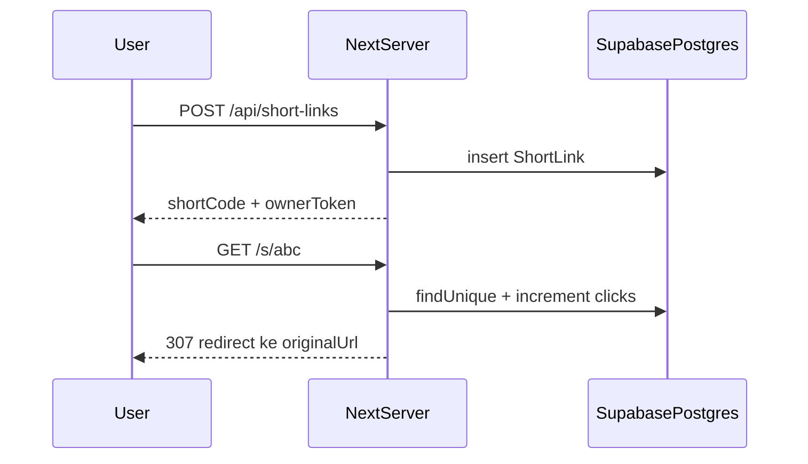

# Supabase + Prisma untuk URL shortener (perilaku mirip bit.ly)

## Konteks kode saat ini

- Redirect ada di [`app/s/[code]/page.tsx`](app/s/[code]/page.tsx): **client-only**, baca `localStorage`, lalu `window.location.replace` — sehingga pengunjung lain tidak punya mapping.
- Pembuatan daftar di [`features/url-shortener/hooks/useUrlShortener.ts`](features/url-shortener/hooks/useUrlShortener.ts): hanya `localStorage`.
- Belum ada folder `app/api/`; belum ada Prisma/Supabase di repo.

Agar “seperti bit.ly”, **dua hal wajib**: (1) redirect membaca **database**; (2) saat user membuat link, **POST ke server** yang menulis baris baru. Hanya mengubah redirect tanpa API create tidak cukup.

## 1. Supabase dan variabel lingkungan

- Buat project Supabase, aktifkan **Database**.
- Untuk hosting serverless (mis. Vercel), pakai **connection string pooler** (Transaction mode) sebagai `DATABASE_URL` agar tidak kehabisan koneksi.
- Ikuti [Prisma + Supabase](https://www.prisma.io/docs/orm/overview/databases/supabase): set juga `DIRECT_URL` (koneksi langsung non-pooler) untuk `prisma migrate`.
- Tambahkan ke `.env` / Vercel: `DATABASE_URL`, `DIRECT_URL` (jika dipakai di schema), dan jangan commit secret.

## 2. Prisma: dependensi dan skema

- Install: `prisma`, `@prisma/client`.
- File baru: [`prisma/schema.prisma`](prisma/schema.prisma) dengan datasource `postgresql` (`url` + `directUrl` sesuai dokumen Prisma–Supabase).
- Model minimal (disarankan):
  - `ShortLink`: `id` (cuid/uuid), `shortCode` (**unique**, indexed), `originalUrl` (text), `clickCount` (int, default 0), `createdAt`.
  - `ownerToken` (string **unique**, acak panjang — dipakai nanti untuk **hapus** / **ambil statistik** tanpa login; dikembalikan sekali dari API create dan disimpan di `localStorage` bersama entri daftar).

- Migrasi pertama: `npx prisma migrate dev` (lokal) lalu deploy migrasi ke Supabase.

- Singleton client: [`lib/prisma.ts`](lib/prisma.ts) ( pola `globalThis` untuk dev agar tidak membuat koneksi ganda).

## 3. API Route: membuat tautan

- File baru: [`app/api/short-links/route.ts`](app/api/short-links/route.ts) — `POST` saja untuk MVP.
  - Body: `{ url: string, alias?: string }` — reuse aturan dari [`features/url-shortener/utils.ts`](features/url-shortener/utils.ts) (`urlSchema` / normalisasi `https://`).
  - Generate `shortCode` (sama seperti [`generateShortCode`](features/url-shortener/utils.ts)) atau pakai `alias` jika unik; jika bentrok → 409.
  - Generate `ownerToken` (mis. `crypto.randomBytes` / `nanoid`).
  - `prisma.shortLink.create(...)`.
  - Response JSON: `shortCode`, `originalUrl`, `ownerToken`, `clickCount`, `createdAt`, `id` (untuk referensi).

Opsional keamanan: rate limit sederhana (header IP / middleware) — bisa ditulis sebagai follow-up.

## 4. Redirect server-side: `/s/[code]`

- Ganti [`app/s/[code]/page.tsx`](app/s/[code]/page.tsx) menjadi **Server Component** (hapus `"use client"` dan `useEffect`).
  - `params` di Next 15+ bertipe `Promise` — `await params` sesuai versi proyek Anda ([`package.json`](package.json) Next 16).
  - `findUnique({ where: { shortCode } })`; jika null → tampilkan UI error (bisa komponen client kecil untuk tombol kembali) atau `notFound()`.
  - Dalam **satu transaksi** (disarankan): increment `clickCount` (dan jika nanti ada tabel `ClickEvent`, insert satu baris di sini).
  - Panggil `redirect(link.originalUrl)` dari `next/navigation` (redirect eksternal didukung untuk URL absolut).

Dampak: pemanggilan `ipapi` / `UAParser` di client untuk analytics **tidak jalan lagi** di halaman redirect; untuk paritas fitur drawer nanti, statistik detail bisa ditambah lewat tabel klik + header `User-Agent` / geo Vercel di route (fase 2).

## 5. Integrasi hook UI dengan API (tetap bisa pakai localStorage untuk daftar)

- Update [`useUrlShortener.ts`](features/url-shortener/hooks/useUrlShortener.ts):
  - **Perbaiki race** simpan/muat: jangan `setItem` dengan array kosong sebelum load pertama dari `localStorage` selesai (flag `hydrated` / skip write pertama).
  - `shortenUrl`: `fetch` `POST /api/short-links`, lalu `setUrls` dengan data dari server + simpan `ownerToken` di objek lokal (perlu perluas tipe di [`types.ts`](features/url-shortener/types.ts) untuk field opsional `ownerToken` / `serverId`).
  - Daftar tetap bisa di-render dari state yang di-hydrate dari `localStorage`; isi daftar untuk link **baru** harus dari response API agar `shortCode` pasti ada di DB.

- **Hapus** server: untuk MVP bisa hanya menghapus dari state + `localStorage` (baris DB tetap — orphan); atau tambah `DELETE /api/short-links` dengan body `{ shortCode, ownerToken }` agar konsisten (disarankan jika `ownerToken` sudah ada).

## 6. Perbaikan kecil terkait

- Link “kembali” di error redirect saat ini mengarah ke [`/produktivitas/url-shortener`](app/s/[code]/page.tsx) padahal route tool ada di **`/utilitas/url-shortener`** — sesuaikan saat menyentuh file itu.

## 7. Verifikasi

- `npx prisma validate`, `npm run build`, uji manual: buat link di browser A, buka `/s/...` di browser B (tanpa localStorage yang sama) harus redirect.
- Opsional: tes unit untuk parser validasi URL / generator kode (yang sudah ada di utils).

## Lingkup yang sengaja ditunda (boleh iterasi berikut)

- Login Supabase Auth.
- Tabel `ClickEvent` penuh + mengisi [`AnalyticsDrawer`](features/url-shortener/components/AnalyticsDrawer.tsx) dari API (setelah redirect server, analytics client lama tidak relevan).
- Moderasi URL berbahaya / blocklist domain.
